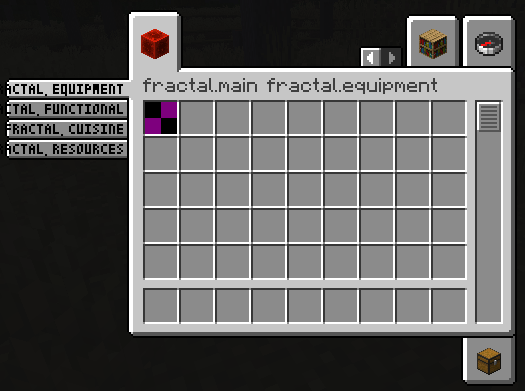
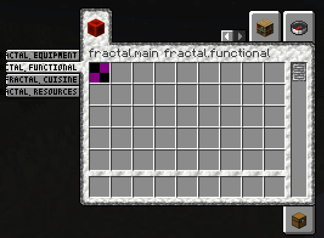

# About Fractal
This repo is a fork of [lib39/fractal](https://git.sleeping.town/unascribed-mods/Lib39) by unascribed, with added support for styled groups. I will take care of this repo while unascribed is busy.

Fractal introduces item **subgroups for the creative menu**.

### Why Fractal?

- Fractals Subgroups are very condensed, allowing you to add up to 12 subgroups for each of your tabs
- Creating a new ItemSubGroup only takes one line of code and no changes in the way you assign your items to groups. Just pass them the ItemSubGroup instead of your main item group

## Examples

### Vanilla Style Subgroups



```java
public static final Identifier GROUP_ID = new Identifier("mymod", "main");
public static final ItemGroup MAIN = FabricItemGroup.builder(GROUP_ID)
		.icon(() -> new ItemStack(Blocks.REDSTONE_BLOCK))
		.entries((displayContext, entries) -> entries.add(Items.APPLE))
		.noRenderedName()
		.build();

public static final Item I1 = new Item(new Item.Settings());
public static final Item I2 = new Item(new Item.Settings());
public static final Item I3 = new Item(new Item.Settings());
public static final Item I4 = new Item(new Item.Settings());

public static final ItemGroup EQUIPMENT = new ItemSubGroup.Builder(MAIN, Text.translatable("itemGroup.fractal.equipment")).entries((displayContext, entries) -> entries.add(I1)).build();
public static final ItemGroup FUNCTIONAL = new ItemSubGroup.Builder(MAIN, Text.translatable("itemGroup.fractal.functional")).entries((displayContext, entries) -> entries.add(I2)).build();
public static final ItemGroup CUISINE = new ItemSubGroup.Builder(MAIN, Text.translatable("itemGroup.fractal.cuisine")).entries((displayContext, entries) -> entries.add(I3)).build();
public static final ItemGroup RESOURCES = new ItemSubGroup.Builder(MAIN, Text.translatable("itemGroup.fractal.resources")).entries((displayContext, entries) -> entries.add(I4)).build();
```

### Applying a custom style
You are also able to apply a style to your ItemSubGroups, by supplying a custom texture that will be getting used as background for your subgroup. You can even mix and match!
In this example, the first two ItemSubGroups use a custom style by supplying a texture file that is being shipped with your mod. The latter two tabs use the vanilla style.

Just ship a modified [Texture Template](images/tabs_template.png) in your mods resources folder, and you are good to go!



```java
public static final Identifier ITEM_GROUP_BACKGROUND_TEXTURE_IDENTIFIER = new Identifier("mymod", "textures/item_group.png");

public static final ItemGroup EQUIPMENT = new ItemSubGroup.Builder(MAIN, Text.translatable("itemGroup.mymod.equipment")).backgroundTexture(ITEM_GROUP_BACKGROUND_TEXTURE_IDENTIFIER).entries((displayContext, entries) -> entries.add(I1)).build();
public static final ItemGroup FUNCTIONAL = new ItemSubGroup.Builder(MAIN, Text.translatable("itemGroup.mymod.functional")).backgroundTexture(ITEM_GROUP_BACKGROUND_TEXTURE_IDENTIFIER).entries((displayContext, entries) -> entries.add(I2)).build();
public static final ItemGroup CUISINE = new ItemSubGroup.Builder(MAIN, Text.translatable("itemGroup.mymod.cuisine")).entries((displayContext, entries) -> entries.add(I3)).build();
public static final ItemGroup RESOURCES = new ItemSubGroup.Builder(MAIN, Text.translatable("itemGroup.mymod.resources")).entries((displayContext, entries) -> entries.add(I4)).build();
```